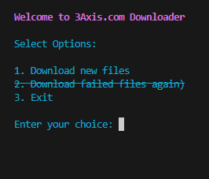

# 3Axis.com Downloader

## Overview

This Python script allows you to download files from 3Axis.com. It utilizes Selenium, BeautifulSoup, and Requests to automate the process of retrieving source code, extracting links and names, and downloading files from the website.

## Prerequisites

- Python 3
- Required Python packages (install them using `pip install -r requirements.txt`):
  - `requests`
  - `selenium`
  - `beautifulsoup4`
  - `colorama`
- [ChromeDriver](https://sites.google.com/chromium.org/driver/) (Make sure it is compatible with your Chrome browser version)

## Usage

1. Clone the repository:
   ```
   git clone https://github.com/your-username/3axis.co_downloader.git

2. Change into the project directory:
   ```
   cd 3axis-downloader
3. Install the required Python packages:
   ```
   pip install -r requirements.txt

4. Download ChromeDriver:
   - Visit the <a href="https://sites.google.com/chromium.org/driver/downloads">ChromeDriver download page</a>.
   - Download the version compatible with your Chrome browser.
   - Extract the downloaded archive.

5. Move ChromeDriver to the project directory:
   - Move the chromedriver executable to the project directory.

6. Run the script:
   ```
   python downloader_3axis.co_web.py

## Screenshots




## Options
- Download new files: Download files from specified page range.
- Download failed files again: Retry downloading files that failed in the previous attempt.
- Exit: Exit the downloader.

## Notes
- Ensure you have the necessary dependencies installed before running the script.
- If you encounter any issues or have suggestions, feel free to open an issue.


## Folder Structure
The downloaded files are organized in the Downloaded_files directory, with subdirectories for each page.

Downloaded_files/
 - page_1/
    - failed_log.txt
    - Files downloaded from page 1
 - page_2/
    - failed_log.txt
    - Files downloaded from page 2
 - ...


## License
This project is licensed under the [MIT License](https://github.com/MrManiesh/3axis.co_downloader/blob/main/LICENSE).

Feel free to contribute and report issues. Happy downloading!
